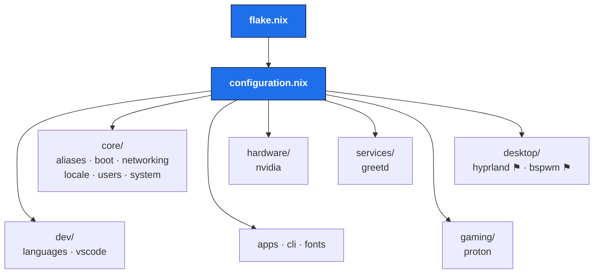

# nixos

Personal NixOS flake for host **`nixos`** — a flakes-based, modular system
config split into focused modules under [`modules/`](modules/). Tracks
`nixos-unstable`, with a few packages pinned to `nixos-25.05`.

- **Desktops:** Hyprland (Wayland) and bspwm (X11), selectable at the
  [greetd / tuigreet](modules/services/greetd.nix) login screen
- **GPU:** NVIDIA (proprietary)
- **State version:** 24.05

## Architecture



**Legend:** `flake.nix` defines the system and hands off to `configuration.nix`,
which `imports` every module group. The `⚑` marks desktops gated behind an
`enable` option set in `configuration.nix`.

## Layout

```
.
├── flake.nix                  # inputs, overlays, nixosSystem + inline module
├── configuration.nix          # imports every module; host-wide settings
├── hardware-configuration.nix # generated; disks, kernel modules
├── modules/
│   ├── core/                  # aliases, boot, networking, locale, users, system
│   ├── services/              # greetd (tuigreet login manager)
│   ├── desktop/               # hyprland/ + bspwm/ (each enable-gated)
│   ├── hardware/              # nvidia
│   ├── dev/                   # languages (Python, Go), vscode
│   ├── applications/          # GUI apps (Chrome, Discord, Telegram…)
│   ├── cli/                   # CLI tools + custom scripts package
│   ├── gaming/                # proton (Steam/GameMode live in flake.nix)
│   ├── media/obs/             # OBS flake module (consumed as an input)
│   └── fonts.nix              # font set
├── scripts/                   # shell scripts → built into one package
│   ├── default.nix            #   reads every file here via symlinkJoin
│   ├── lock · play-last · show-desktop · enable-side-monitor
├── configs/                   # raw dotfiles kept in-repo
│   ├── wayland/hyprland/hyprland.conf
│   └── x11/{bspwm/bspwmrc, sxhkd/sxhkdrc}
└── README.md
```

> Some module dirs also hold stub files (e.g. `desktop/wayland-common.nix`,
> `hardware/audio.nix`, `media/*`) that aren't imported yet — scaffolding for
> future splits. Only the wired-up modules appear in the diagram above.

## Rebuilding

Convenience aliases live in [`modules/core/aliases.nix`](modules/core/aliases.nix):

| Alias          | Command                                                              |
| -------------- | ------------------------------------------------------------------- |
| `rebuild`      | `sudo nixos-rebuild switch --flake /etc/nixos/.`                    |
| `rebuild-lock` | `… --flake /etc/nixos/. --no-update-lock-file`                      |

```bash
# apply current config
rebuild

# update inputs first, then apply
nix flake update && rebuild
```

`/etc/nixos` is owned by your user, so editing modules needs no `sudo` — only
the rebuild does.

## Desktop sessions

Both window managers are enabled via options and picked at login:

```nix
# configuration.nix
desktop.hyprland.enable = true;   # Wayland
desktop.bspwm.enable    = true;   # X11
```

The Hyprland runtime config lives at
[`configs/wayland/hyprland/hyprland.conf`](configs/wayland/hyprland/hyprland.conf)
and is symlinked to `~/.config/hypr/hyprland.conf` — edit either path, it's the
same file.

The Waybar config lives at
[`configs/wayland/waybar/`](configs/wayland/waybar/) (config, `style.css`,
`scripts/`, `themes/`, `assets/`) and the whole directory is symlinked to
`~/.config/waybar` — edit either path, it's the same files.

## External inputs

| Input                   | Used for                                            |
| ----------------------- | --------------------------------------------------- |
| `nixpkgs` (unstable)    | primary package set                                 |
| `nixpkgs-2505`          | pinned `gimp`, `xwaylandvideobridge`                |
| `swww`                  | Wayland wallpaper daemon                            |
| `obs-module`            | OBS Studio NixOS module (`modules/media/obs`)       |
| `nix-vscode-extensions` | VS Code marketplace extensions overlay              |
